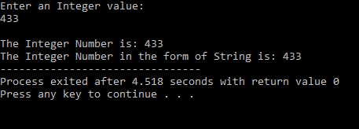
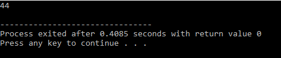

A stringstream associates a string object with a stream allowing you to read from the string as if it were a stream (like cin).

Header File: sstream

The output for the Basic Program for using the stringstream is:

We can use this even use this to access the data of different types even when it is stored with some other datatype.
The output for the Using stringstream string input as an integer is:

